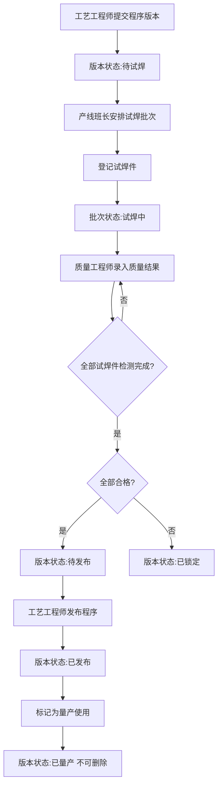

## 1. 产品概述

机器人焊接程序变更审批系统,用于管控焊接程序从版本提交、试焊验证到正式发布的全流程。系统将工艺工程师、产线班长、质量工程师三类角色协同在同一审批链路上,确保"未通过试焊验证的程序不得发布、质量不合格的版本自动锁定、已量产程序不可删除"等核心质量门禁得到强制执行,目标用户为汽车/机械制造工厂的焊接工艺与质量管控团队。

## 2. 核心功能

### 2.1 用户角色

| 角色 | 登录方式 | 核心权限 |
|------|----------|----------|
| 工艺工程师 | 角色切换进入 | 提交焊接程序版本、编辑草稿、发起发布、设为量产使用 |
| 产线班长 | 角色切换进入 | 安排试焊批次、登记试焊件、更新试焊进度 |
| 质量工程师 | 角色切换进入 | 录入试焊件拉力与外观检测结果、提交检测结论 |

### 2.2 功能模块

1. **工作台**:质量门禁状态总览、各角色待办、程序版本状态分布
2. **焊接程序版本管理**:版本提交与编辑、版本详情、发布与锁定控制
3. **试焊批次管理**:班长安排批次、试焊件登记、试焊进度跟踪
4. **质量结果录入**:质量工程师录入拉力值与外观评级、判定合格与否
5. **发布记录**:发布历史、量产标记管理

### 2.3 页面详情

| 页面名称 | 模块名称 | 功能描述 |
|-----------|-------------|---------------------|
| 工作台 | 门禁状态总览 | 统计草稿/待试焊/试焊中/待发布/已发布/已锁定/已量产各状态数量 |
| 工作台 | 角色待办区 | 按当前角色展示待提交、待安排试焊、待检测等任务卡片 |
| 工作台 | 质量门禁提醒 | 高亮未完成试焊不可发布、不合格版本已锁定等门禁状态 |
| 焊接程序版本管理 | 版本列表 | 展示程序编号、版本号、状态标签、试焊进度条、发布标记 |
| 焊接程序版本管理 | 版本提交卡片 | 工艺工程师填写程序编号、版本、焊接参数并提交 |
| 焊接程序版本管理 | 版本详情抽屉 | 展示参数、关联试焊批次、试焊件及质量结果、发布记录 |
| 焊接程序版本管理 | 发布/锁定控制 | 发布前自动校验试焊完成与合格,不合格自动锁定 |
| 试焊批次管理 | 批次列表 | 展示批次号、关联程序版本、试焊件数、进度状态 |
| 试焊批次管理 | 安排批次 | 班长选择程序版本、设定试焊件数量生成批次 |
| 试焊批次管理 | 试焊件清单 | 逐件登记试焊件编号,更新试焊状态 |
| 质量结果录入 | 待检测列表 | 质量工程师查看待录入结果的试焊件 |
| 质量结果录入 | 结果录入表单 | 录入拉力值(N)、外观评级(合格/临界/不合格)、检测结论 |
| 发布记录 | 发布历史表 | 展示发布版本、发布人、发布时间、量产标记 |
| 发布记录 | 量产标记管理 | 将已发布程序标记为量产使用,锁定删除权限 |

## 3. 核心流程

工艺工程师提交焊接程序版本后,版本进入"待试焊"状态;产线班长为该版本安排试焊批次并登记试焊件,批次进入"试焊中";试焊完成后质量工程师逐件录入拉力值与外观评级并判定结果。当批次内所有试焊件均完成检测且全部合格时,版本进入"待发布",工艺工程师可执行发布;若存在任一不合格结果,版本自动锁定为"已锁定",不可发布。发布后的程序可由工艺工程师标记为"已量产",一旦进入量产状态即不可删除。

## 4. 用户界面设计

### 4.1 设计风格

- **主色调**:钢铁深灰(#16181d 背景 / #1f232b 卡片),营造工业车间金属质感
- **强调色**:焊接火花橙(#ff6a1a),用于主操作按钮与进度高亮,呼应焊接主题
- **状态色**:已发布/合格绿(#2ecc71)、已锁定/不合格红(#e53935)、待处理琥珀(#f5a623)
- **字体**:标题使用工业几何感展示字体,正文使用清晰可读的等宽/无衬线字体,数据强调使用等宽字体凸显测量值
- **布局**:左侧固定导航栏 + 顶部角色切换条 + 主内容区卡片栅格,桌面优先
- **质感细节**:金属磨砂渐变、细微噪点纹理、焊缝分隔线、状态徽章带轻微发光

### 4.2 页面设计概述

| 页面名称 | 模块名称 | UI 元素 |
|-----------|-------------|-------------|
| 工作台 | 门禁状态总览 | 深色网格背景,状态数字大字号琥珀发光,卡片带金属边框 |
| 工作台 | 角色待办区 | 卡片堆叠,左侧色条标识优先级,hover 抬升阴影 |
| 焊接程序版本管理 | 版本列表 | 表格行,状态彩色徽章,进度条橙绿渐变 |
| 焊接程序版本管理 | 版本提交卡片 | 抽屉式表单,参数分区输入,提交按钮焊接橙 |
| 试焊批次管理 | 批次列表 | 卡片网格,每卡含试焊件缩略进度环 |
| 质量结果录入 | 结果录入表单 | 拉力值大数字输入,外观评级分段选择器 |
| 发布记录 | 发布历史表 | 时间轴样式,量产标记齿轮图标 |

### 4.3 响应式

桌面优先设计,目标为工厂办公电脑大屏(1280px+)。在窄屏下导航栏折叠为图标条,表格转为卡片堆叠,保证产线现场平板可查看关键状态。
