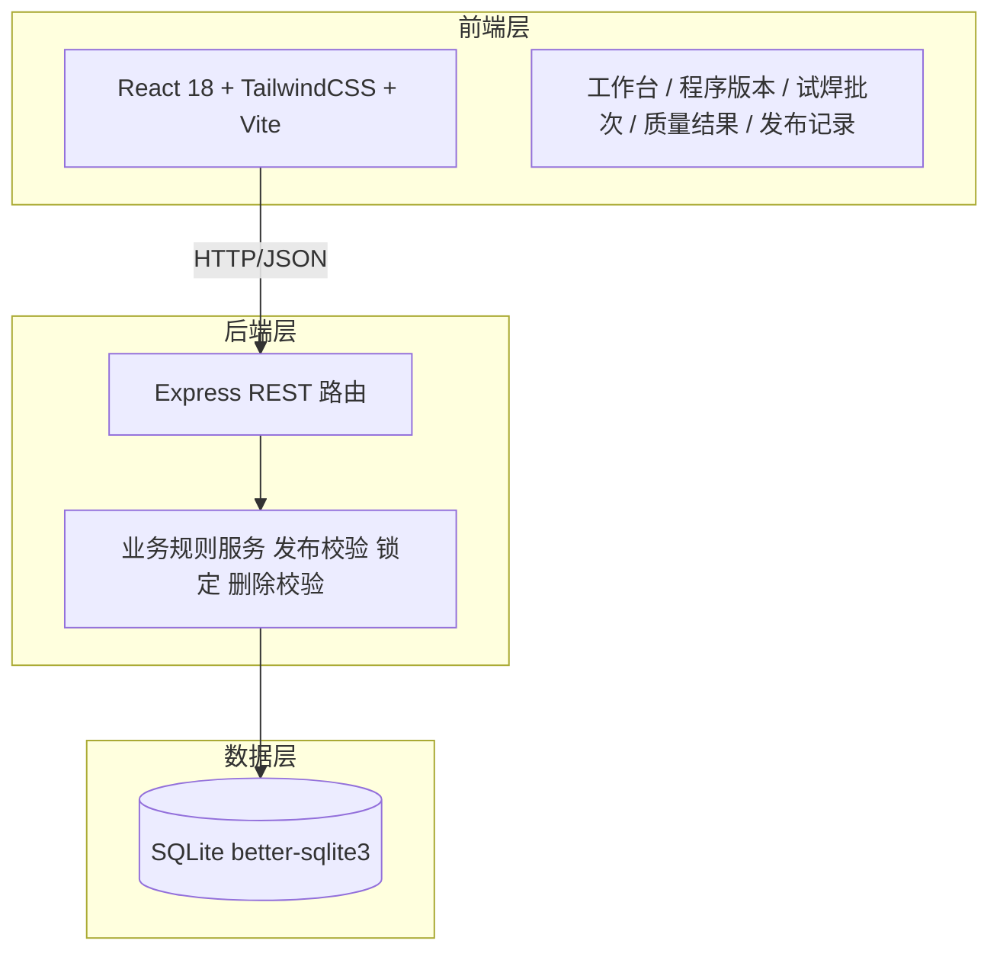
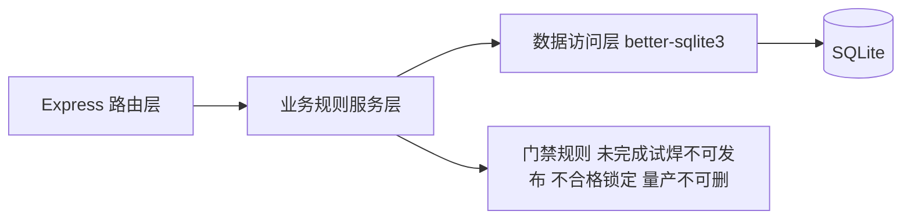
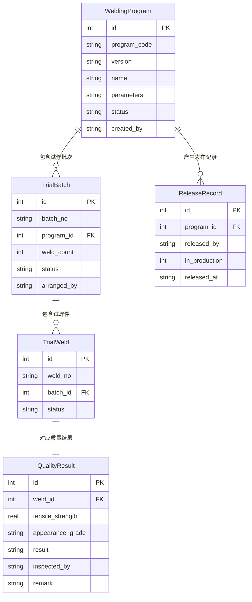

## 1. 架构设计



## 2. 技术描述

- **前端**:React@18 + tailwindcss@3 + vite,使用 react-router-dom 路由
- **初始化工具**:vite-init (npm create vite@latest)
- **后端**:Express@4,内置业务规则校验中间件
- **数据库**:SQLite (better-sqlite3 同步驱动,适合单机内网部署)
- **数据交互**:前端 fetch 调用后端 REST API,JSON 格式

## 3. 路由定义

| 路由 | 用途 |
|-------|---------|
| / | 工作台,门禁状态总览与角色待办 |
| /programs | 焊接程序版本管理列表 |
| /programs/:id | 焊接程序版本详情(抽屉/弹窗) |
| /trials | 试焊批次管理 |
| /quality | 质量结果录入 |
| /releases | 发布记录与量产标记管理 |

## 4. API 定义

```typescript
// 焊接程序版本
interface WeldingProgram {
  id: number;
  program_code: string;      // 程序编号
  version: string;            // 版本号
  name: string;               // 程序名称
  parameters: string;         // 焊接参数 JSON
  status: 'draft' | 'pending_trial' | 'trialing' | 'ready_to_publish' | 'published' | 'locked' | 'in_production';
  created_by: string;
  created_at: string;
  updated_at: string;
}

// 试焊批次
interface TrialBatch {
  id: number;
  batch_no: string;
  program_id: number;
  weld_count: number;
  status: 'pending' | 'trialing' | 'completed';
  arranged_by: string;
  created_at: string;
}

// 试焊件
interface TrialWeld {
  id: number;
  weld_no: string;
  batch_id: number;
  status: 'pending' | 'qualified' | 'unqualified';
  created_at: string;
}

// 质量结果
interface QualityResult {
  id: number;
  weld_id: number;
  tensile_strength: number;    // 拉力值 N
  appearance_grade: 'pass' | 'marginal' | 'fail';
  result: 'qualified' | 'unqualified';
  inspected_by: string;
  remark: string;
  inspected_at: string;
}

// 发布记录
interface ReleaseRecord {
  id: number;
  program_id: number;
  released_by: string;
  in_production: 0 | 1;
  released_at: string;
}
```

| 方法 | 路径 | 用途 |
|------|------|------|
| GET | /api/programs | 查询程序版本列表 |
| POST | /api/programs | 工艺工程师提交程序版本 |
| GET | /api/programs/:id | 查询程序版本详情(含批次/试焊件/质量结果) |
| DELETE | /api/programs/:id | 删除程序版本(校验非量产) |
| POST | /api/programs/:id/publish | 发布程序(校验试焊完成且全部合格) |
| POST | /api/programs/:id/lock | 锁定版本(质量不合格触发) |
| POST | /api/programs/:id/mark-production | 标记为量产使用 |
| GET | /api/trial-batches | 查询试焊批次 |
| POST | /api/trial-batches | 班长安排试焊批次 |
| GET | /api/trial-batches/:id/welds | 查询批次下试焊件 |
| POST | /api/trial-welds | 登记试焊件 |
| POST | /api/quality-results | 质量工程师录入质量结果(触发合格判定与版本状态联动) |
| GET | /api/releases | 查询发布记录 |

## 5. 服务端架构图



业务规则服务层核心校验:
- **发布校验**:发布前检查该版本所有试焊批次状态为 completed 且所有试焊件质量结果为 qualified,否则拒绝发布
- **自动锁定**:录入质量结果时若出现 unqualified,将该版本状态置为 locked
- **删除校验**:删除前检查版本是否处于 in_production 或已被发布记录引用为量产,否则允许删除

## 6. 数据模型

### 6.1 数据模型定义



### 6.2 数据定义语言

```sql
CREATE TABLE IF NOT EXISTS welding_programs (
  id INTEGER PRIMARY KEY AUTOINCREMENT,
  program_code TEXT NOT NULL,
  version TEXT NOT NULL,
  name TEXT NOT NULL,
  parameters TEXT,
  status TEXT NOT NULL DEFAULT 'draft',
  created_by TEXT NOT NULL,
  created_at TEXT NOT NULL DEFAULT (datetime('now','localtime')),
  updated_at TEXT NOT NULL DEFAULT (datetime('now','localtime'))
);

CREATE TABLE IF NOT EXISTS trial_batches (
  id INTEGER PRIMARY KEY AUTOINCREMENT,
  batch_no TEXT NOT NULL,
  program_id INTEGER NOT NULL,
  weld_count INTEGER NOT NULL DEFAULT 0,
  status TEXT NOT NULL DEFAULT 'pending',
  arranged_by TEXT NOT NULL,
  created_at TEXT NOT NULL DEFAULT (datetime('now','localtime')),
  FOREIGN KEY (program_id) REFERENCES welding_programs(id)
);

CREATE TABLE IF NOT EXISTS trial_welds (
  id INTEGER PRIMARY KEY AUTOINCREMENT,
  weld_no TEXT NOT NULL,
  batch_id INTEGER NOT NULL,
  status TEXT NOT NULL DEFAULT 'pending',
  created_at TEXT NOT NULL DEFAULT (datetime('now','localtime')),
  FOREIGN KEY (batch_id) REFERENCES trial_batches(id)
);

CREATE TABLE IF NOT EXISTS quality_results (
  id INTEGER PRIMARY KEY AUTOINCREMENT,
  weld_id INTEGER NOT NULL UNIQUE,
  tensile_strength REAL,
  appearance_grade TEXT,
  result TEXT NOT NULL,
  inspected_by TEXT NOT NULL,
  remark TEXT,
  inspected_at TEXT NOT NULL DEFAULT (datetime('now','localtime')),
  FOREIGN KEY (weld_id) REFERENCES trial_welds(id)
);

CREATE TABLE IF NOT EXISTS release_records (
  id INTEGER PRIMARY KEY AUTOINCREMENT,
  program_id INTEGER NOT NULL,
  released_by TEXT NOT NULL,
  in_production INTEGER NOT NULL DEFAULT 0,
  released_at TEXT NOT NULL DEFAULT (datetime('now','localtime')),
  FOREIGN KEY (program_id) REFERENCES welding_programs(id)
);

CREATE INDEX IF NOT EXISTS idx_programs_status ON welding_programs(status);
CREATE INDEX IF NOT EXISTS idx_batches_program ON trial_batches(program_id);
CREATE INDEX IF NOT EXISTS idx_welds_batch ON trial_welds(batch_id);
CREATE INDEX IF NOT EXISTS idx_releases_program ON release_records(program_id);
```
